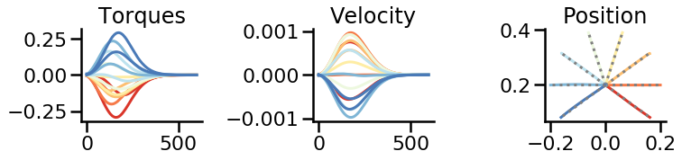

# iLQR-jax

Optimize external inputs to a neural network model such that it controls a simple arm model. 
* Arm: two-link model [Li & Todorov 2004](https://citeseerx.ist.psu.edu/viewdoc/summary?doi=10.1.1.85.5196)
* Network: vanilla RNN with recurrent parameters optimized using approach from [Hennequin et al. 2014](https://doi.org/10.1016/j.neuron.2014.04.045)
* Optimizer: iterative linear quadratic regulator (iLQR). 

Implementation in jax. Use`grad` to compute linear-quadratic approximation to system dynamics and cost function, and `vmap` to turn the local trajectory optimization into a slightly more global algorithm. 

Dashed gray lines: targets, colored lines: optimized trajectories. 

<figure>
    
</figure>

